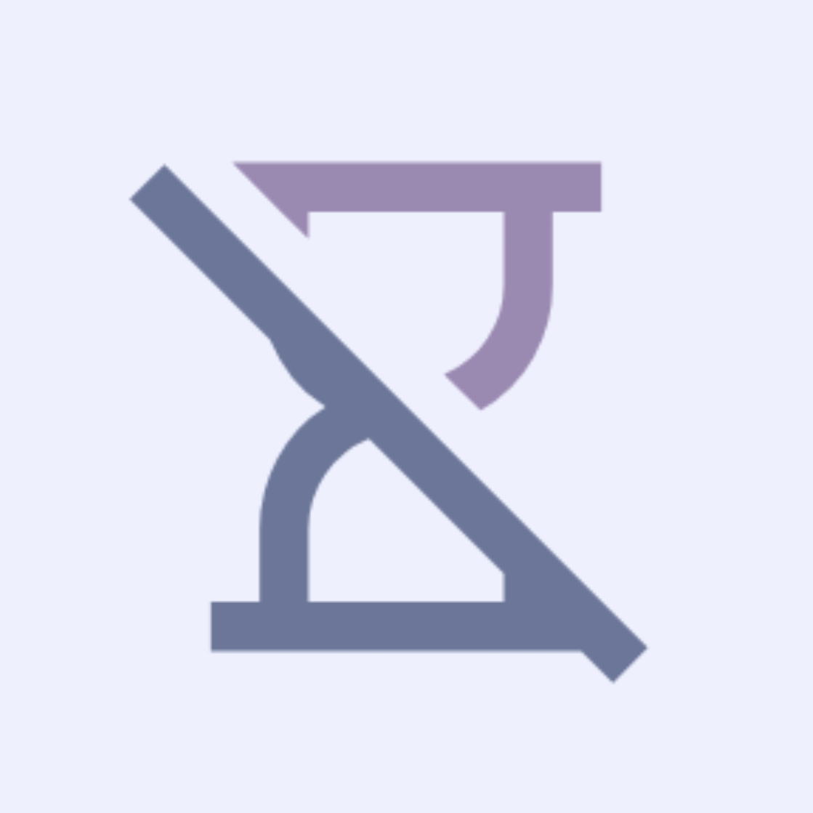

<div align="center">
  

  <h1>Reef</h1>

[](https://opensource.org/licenses/MIT)
[](https://apt.izzysoft.de/packages/dev.pranav.reef)
[](https://hosted.weblate.org/engage/reef/)

</div>

<div align="center">
  <a href="https://apt.izzysoft.de/packages/dev.pranav.reef">
    
  </a>
</div>

Reef is an open-source Android app designed to help you reclaim your focus and build healthier
digital habits. Block distracting apps, track your screen time with detailed analytics, and use
proven productivity techniques like Pomodoro—all wrapped in a beautiful Material You design.

**No ads • No subscriptions • No tracking • Completely free**

---

## Screenshots

<p align="center">
  
  
  
</p>

<p align="center">
  
  
  
</p>

<p align="center">
  
  
  
</p>

---

## Features

- Focus timer with Simple and Pomodoro modes
- Flexible and Strict modes
- Automatic Do Not Disturb during focus sessions
- Per-app daily time limits with warning notifications
- App blocker
- Routines — schedule app limits by time and day
- App usage statistics with interactive charts
- Focus session history with detailed breakdowns
- Customisable Pomodoro durations, sounds, and vibration

---

## Why Reef?

Unlike other screen time apps with paywalls, subscriptions, and limited features, Reef is completely
free and open source. No premium features locked behind payments, no artificial limitations. Built
with modern Android technologies and the latest Material 3 Expressive design language, it provides a
beautiful experience while helping you build healthier digital habits.

---

## Getting Started

Download from [GitHub Releases](https://github.com/PranavPurwar/Reef/releases)
or [IzzyOnDroid](https://apt.izzysoft.de/packages/dev.pranav.reef).

On first launch, a guided setup walks you through granting the required permissions.

---

## Help Translate

Reef is available in multiple languages. Help make it accessible to more people by contributing
translations on [Weblate](https://hosted.weblate.org/engage/reef/).

---

## Support Development

If Reef has been helpful to you, please consider supporting its development with a small donation.
Every contribution matters.

**Open Collective:** https://opencollective.com/invokevirtual

**Bitcoin (BTC):** `bc1q3eesyfn7lhql4c2khv56cyvw2374zkhe7r97hz`

**Ethereum (ETH):** `0xD80A8D6E0fa433A8bDFC2D3F325159Db70605816`

**Monero (XMR):**
`848dAWBVk8GMaoRHg6HUP5CbkpY9pJra1KNQAo9yJ6vbJLFsjFD8ZHkGpi6FhVY7rsD4U9iR7brk64eknsC3bS7tV9JRU4f`

**Solana (SOL):** `7FxTAJLmhXFp6wxVbUTpf8jDmzEX1CKVMdE8oLPNQvyb`

**Litecoin (LTC):** `ltc1q3pqyj5ge5rdmqr00w03x4tlhm6rhcc6wrfyx8k`

**UPI (India):** `pranavpurwar@fam`


---

## License

Reef is licensed under the [MIT License](https://opensource.org/licenses/MIT). You are free to use,
modify, and distribute this
software.

### 1. Mandatory Attribution

Any derivative work, fork, or redistribution of this software **must** include a prominent link back
to the original repository.
This link must be visible to the end-user (e.g., in the "About" or "Settings" screen of the app).

### 2. Trademark & Branding

The name **"Reef"** and the **official app icon** are trademarks of Pranav Purwar.

* You are **not** permitted to use the name "Reef" or the original icon for any derivative works or
  forks.
* Any redistribution must use a distinct name, a different package ID (e.g., changing
  `com.pranav.reef` to something else), and a unique launcher icon.
* This is to prevent confusion among users and to maintain the integrity of the original project.

```text
MIT License

Copyright (c) 2023-2026 Pranav Purwar

Permission is hereby granted, free of charge, to any person obtaining a copy
of this software and associated documentation files (the "Software"), to deal
in the Software without restriction, including without limitation the rights
to use, copy, modify, merge, publish, distribute, sublicense, and/or sell
copies of the Software, and to permit persons to whom the Software is
furnished to do so, subject to the following conditions:

The above copyright notice and this permission notice shall be included in all
copies or substantial portions of the Software.

THE SOFTWARE IS PROVIDED "AS IS", WITHOUT WARRANTY OF ANY KIND, EXPRESS OR
IMPLIED, INCLUDING BUT NOT LIMITED TO THE WARRANTIES OF MERCHANTABILITY,
FITNESS FOR A PARTICULAR PURPOSE AND NONINFRINGEMENT. IN NO EVENT SHALL THE
AUTHORS OR COPYRIGHT HOLDERS BE LIABLE FOR ANY CLAIM, DAMAGES OR OTHER
LIABILITY, WHETHER IN AN ACTION OF CONTRACT, TORT OR OTHERWISE, ARISING FROM,
OUT OF OR IN CONNECTION WITH THE SOFTWARE OR THE USE OR OTHER DEALINGS IN THE
SOFTWARE.
```

---

Thank you for using Reef! Together, we can build healthier digital habits.
